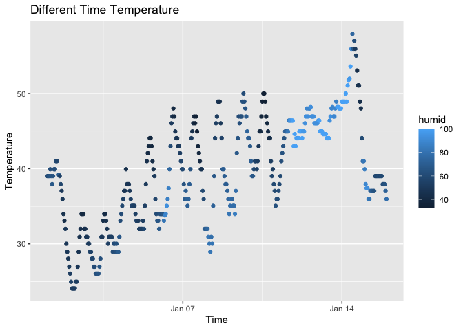

hw1
================
2023-09-22

# Problem 1

``` r
library(moderndive)
library(tidyverse)
```

    ## ── Attaching core tidyverse packages ──────────────────────── tidyverse 2.0.0 ──
    ## ✔ dplyr     1.1.3     ✔ readr     2.1.4
    ## ✔ forcats   1.0.0     ✔ stringr   1.5.0
    ## ✔ ggplot2   3.4.3     ✔ tibble    3.2.1
    ## ✔ lubridate 1.9.2     ✔ tidyr     1.3.0
    ## ✔ purrr     1.0.2     
    ## ── Conflicts ────────────────────────────────────────── tidyverse_conflicts() ──
    ## ✖ dplyr::filter() masks stats::filter()
    ## ✖ dplyr::lag()    masks stats::lag()
    ## ℹ Use the conflicted package (<http://conflicted.r-lib.org/>) to force all conflicts to become errors

``` r
data("early_january_weather")
```

### Variables in this dataset

``` r
skimr::skim(early_january_weather)
```

|                                                  |                       |
|:-------------------------------------------------|:----------------------|
| Name                                             | early_january_weather |
| Number of rows                                   | 358                   |
| Number of columns                                | 15                    |
| \_\_\_\_\_\_\_\_\_\_\_\_\_\_\_\_\_\_\_\_\_\_\_   |                       |
| Column type frequency:                           |                       |
| character                                        | 1                     |
| numeric                                          | 13                    |
| POSIXct                                          | 1                     |
| \_\_\_\_\_\_\_\_\_\_\_\_\_\_\_\_\_\_\_\_\_\_\_\_ |                       |
| Group variables                                  | None                  |

Data summary

**Variable type: character**

| skim_variable | n_missing | complete_rate | min | max | empty | n_unique | whitespace |
|:--------------|----------:|--------------:|----:|----:|------:|---------:|-----------:|
| origin        |         0 |             1 |   3 |   3 |     0 |        1 |          0 |

**Variable type: numeric**

| skim_variable | n_missing | complete_rate |    mean |     sd |      p0 |     p25 |     p50 |     p75 |    p100 | hist  |
|:--------------|----------:|--------------:|--------:|-------:|--------:|--------:|--------:|--------:|--------:|:------|
| year          |         0 |          1.00 | 2013.00 |   0.00 | 2013.00 | 2013.00 | 2013.00 | 2013.00 | 2013.00 | ▁▁▇▁▁ |
| month         |         0 |          1.00 |    1.00 |   0.00 |    1.00 |    1.00 |    1.00 |    1.00 |    1.00 | ▁▁▇▁▁ |
| day           |         0 |          1.00 |    8.04 |   4.31 |    1.00 |    4.00 |    8.00 |   12.00 |   15.00 | ▇▇▇▇▇ |
| hour          |         0 |          1.00 |   11.53 |   6.92 |    0.00 |    6.00 |   11.50 |   17.75 |   23.00 | ▇▇▆▇▇ |
| temp          |         0 |          1.00 |   39.58 |   7.06 |   24.08 |   33.98 |   39.02 |   44.96 |   57.92 | ▃▇▇▇▁ |
| dewp          |         0 |          1.00 |   28.06 |  10.73 |    8.96 |   19.94 |   26.06 |   35.06 |   53.06 | ▃▇▆▂▃ |
| humid         |         0 |          1.00 |   65.48 |  18.95 |   32.86 |   51.34 |   61.67 |   78.68 |  100.00 | ▃▇▆▂▅ |
| wind_dir      |         5 |          0.99 |  208.19 | 115.58 |    0.00 |  140.00 |  240.00 |  290.00 |  360.00 | ▅▁▂▇▆ |
| wind_speed    |         0 |          1.00 |    8.23 |   4.61 |    0.00 |    5.75 |    8.06 |   11.51 |   24.17 | ▅▇▆▂▁ |
| wind_gust     |       308 |          0.14 |   22.53 |   3.63 |   16.11 |   19.56 |   21.86 |   25.32 |   31.07 | ▅▇▃▇▁ |
| precip        |         0 |          1.00 |    0.00 |   0.01 |    0.00 |    0.00 |    0.00 |    0.00 |    0.19 | ▇▁▁▁▁ |
| pressure      |        38 |          0.89 | 1022.52 |   5.57 | 1010.80 | 1018.30 | 1022.05 | 1027.23 | 1034.40 | ▃▇▇▇▃ |
| visib         |         0 |          1.00 |    8.52 |   3.00 |    0.12 |    9.00 |   10.00 |   10.00 |   10.00 | ▁▁▁▁▇ |

**Variable type: POSIXct**

| skim_variable | n_missing | complete_rate | min                 | max                 | median              | n_unique |
|:--------------|----------:|--------------:|:--------------------|:--------------------|:--------------------|---------:|
| time_hour     |         0 |             1 | 2013-01-01 01:00:00 | 2013-01-15 23:00:00 | 2013-01-08 12:30:00 |      358 |

### Size of the dateset

``` r
nrow(early_january_weather)
```

    ## [1] 358

``` r
ncol(early_january_weather)
```

    ## [1] 15

### Mean temperature

``` r
mean(early_january_weather$temp)
```

    ## [1] 39.58212

### Scatterplot

``` r
ggplot(early_january_weather, aes(x = time_hour, y = temp)) + geom_point(aes(col = humid)) + labs(y = "Temperature", x = "Time", title = "Different Time Temperature")
```

<!-- -->

``` r
ggsave("scatter_plot.pdf")
```

    ## Saving 7 x 5 in image

### Short description

###### In the early_january_weather dataset, there are 385 observations and 15 variables.

###### The mean temperature is 39.58

###### The name of the variables are: origin, year month, day, hour, temp, dewp, humid, wind_dir, wind_speed, wind_gust, precip, pressure, visib, time_hour.

###### There are a lot of missing data under the varibales wind_gust and pressure.

###### From the scatterplot, the temperature is increasing over time, but the humidity varys.

# Problem 2

``` r
library(tidyverse)

df = tibble(
  vec_numeric = rnorm(10), 
  vec_logical = vec_numeric > 0,
  vec_char = c("one", "two", "three", "four", "five", "six", "seven", "eight", "nine", "ten"), 
  vec_factor = factor(c( "large", "small", "medium", "medium", "large", "small", "large", "small", "small", "medium"))
)

mean_vec_numeric <- pull(df, vec_numeric)
mean(mean_vec_numeric)
```

    ## [1] -0.451244

``` r
mean_vec_logical <- pull(df, vec_logical)
mean(mean_vec_logical)
```

    ## [1] 0.3

###### The mean of random sample and logical vector works, but the mean of character vector cannot be taken. The variables for vec_char and vec_factor are character values. We can only calculate the mean for numerical values.

``` r
rv <- c("one", "two", "three", "four", "five", "six", "seven", "eight", "nine", "ten")
rf <- factor(rv)
x <- as.numeric(rf)
x
```

``` r
vec_logical <- c("large", "small", "medium", "medium", "large", "small", "large", "small", "small", "medium")
vec_num <- as.numeric(vec_logical)
vec_logical
```

##### The as.numeric function converts a character vector into a numeric vector.
